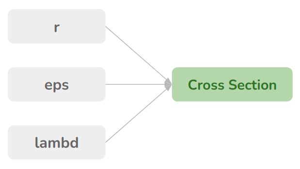
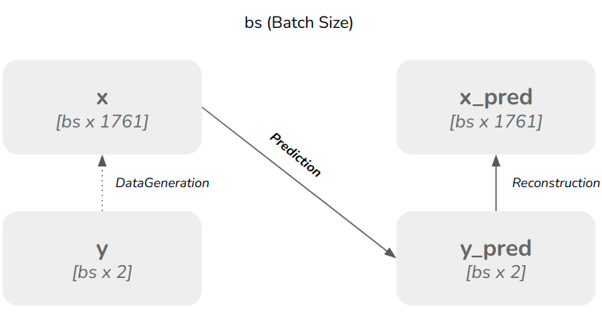

# Walkthrough

## Basic Overview
We're given an absorption spectra of a nanoparticle, our job is to find out all the structural parameters of the nanoparticle. The structural parameters are radii of inner and outer shell of the nanoparticle (r1, r2), and permittivity values (or materials) of the three layers in between (e1, e2, e3).
<br/>
Throughout the experiment, A_abs is plotted w.r.t. wavelength with an wavelength range of 180nm to 1940nm with 1nm interval, containing 1761 samples of A_abs. The input dimension of our model is thus 1761.

## Terms

lambd &rarr; Wavelength (fixed throughout experiment) <br/>
lambd = [180, 181, ......, 1940] <br/>

r &rarr; radii values (dict) <br/>
eps &rarr; permittivity values (dict)
```python
r = {
    'r1': r1, 
    'r2': r2,
}
eps = {
    'e1': e1,
    'e2': e2,
    'e3': e3,
}
```
x &rarr; Input spectra [samples of A_abs] <br/>
y &rarr; Ground truth radii values [r1, r2] <br/>
y_pred &rarr; Predicted radii values [r1_pred, r2_pred] <br/>
x_pred &rarr; Predicted Spectra [samples of A_abs_pred] <br/>

<br/>

# Pipeine

## Data Generation


<br/>
Vary <i>r</i> and <i>eps</i> to generate data with multiple radii pairs and multiple eps values

In all the below configurations, r1 is varied from 5nm to 50nm and r2 is varied from (r1+1) nm to (r1+100) nm for training dataset [only integer values]. For validation dataset, in each class combination, 250 (r1, r2) pairs are generated randomly with value constraints r1 ε [5, 50], r2 ε [r1+1, r2+100].

### E1Data
(e1 : (al2o3, sio2), e2 : au, e3 : air)

Directory structure 

    dataGeneration/E1Data/{train/val}/{e1_cls}/{filecounter}.csv

To Generate E1Data, run the following command
```bash
cd dataGeneration/scripts/
python3 eps1.py
```

### E1E2Data
(e1 : (al2o3, sio2), e2 : (ag, au), e3 : air)

Directory structure 

    dataGeneration/E1E2Data/{train/val}/{e1_cls}/{e2_cls}/{filecounter}.csv

To Generate E1E2Data, run the following command
```bash
cd dataGeneration/scripts/
python3 e1e2.py
```

### E1E2E3Data
(e1 : (al2o3, sio2), e2 : (ag, au), e3 : (air, si, catio3))

Directory structure 

    dataGeneration/E1E2E3Data/{train/val}/{e1_cls}/{e2_cls}/{e3_cls}/{filecounter}.csv

To Generate E1E2E3Data, run the following command
```bash
cd dataGeneration/scripts/
python3 e1e2e3.py
```


## Training and evaluation


<br/>

Prediction flow is implemented with 8 different models. These models are implemented in <b>models/model.py</b>.

In training pipeline, the loss can be calculated w.r.t. <br/>
<ul>
    <li> y_pred vs y &rarr; MSELoss </li>
    <li> 
        x_pred vs x &rarr; In this case, both x & x_pred are matrices of size bs X 1761, containing all the sampled values of A_abs at different wavelengths. A simple MSELoss will work here too, but the main interest in x & x_pred is the peak value and wavelength where peak occurs. So we extract peak Information from both the signals (x & x_pred), which contains lambd_max (wavelength where peak occurs) & A_max (peak value of cross section). Now a MSELoss is applied between lambd_max and lambd_max_pred and ManhattanLoss is applied between A_max and A_max_pred.
    </li>
</ul>

```python
from utils.utils import getPeakInfo

lambd_max, A_max = getPeakInfo(A, lambd, shift=0)
```


### Domains

<ul>
    <li>Domain 0 : loss = MSELoss(y, y_pred) </li>
    <li>Domain 1 : loss = MSELoss(y, y_pred) [Here, y contains (r1/r2, r2-r1) pair instead of (r1, r2) pair] </li>
    <li>Domain 2 : loss = MSELoss(y, y_pred) + MSELoss(lambd_max, lambd_max_pred) + ManhattanLoss(A_max, A_max_pred) </li>
</ul>

